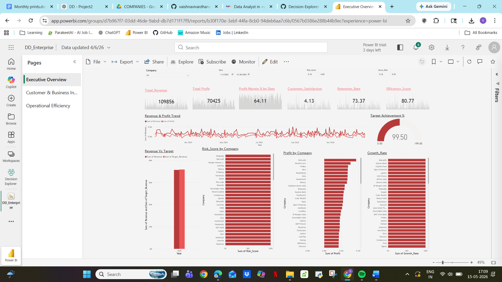
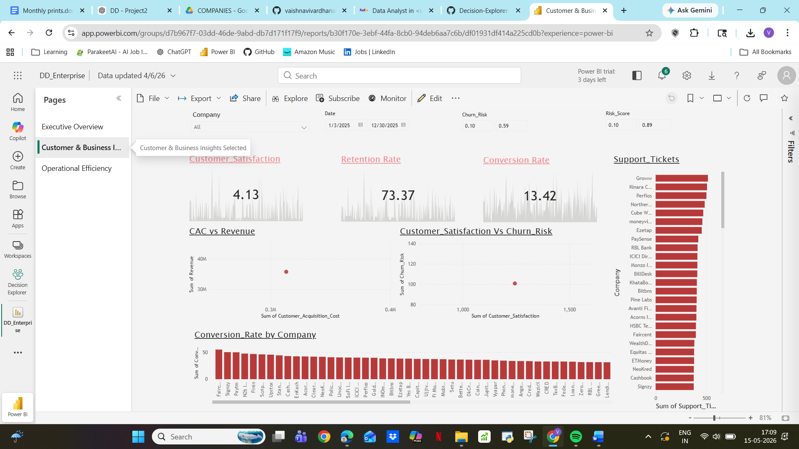
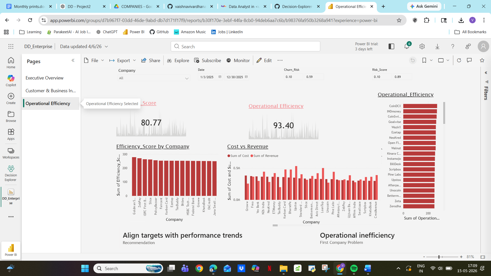

# 🚀 Decision Explorer – AI-Powered Business Insights Platform

## 📌 Overview

Decision Explorer is an interactive analytics system that enables users to explore business insights across multiple domains such as Retail, SaaS, Fintech, and Enterprise.

The system dynamically connects datasets, allows company selection, and redirects users to Power BI dashboards with filtered insights.

---

## 🎯 Problem Statement

Businesses often struggle with:

* Manual data filtering
* Static dashboards
* Slow decision-making processes

This project solves these challenges by enabling dynamic, user-driven analytics.

---

## ⚙️ How It Works

1. The user accesses the application via the portfolio interface
2. Selects a business domain (Retail, SaaS, Fintech, Enterprise)
3. The system dynamically retrieves and processes the corresponding dataset
4. Company options are auto-generated based on the dataset
5. Upon selection, the system constructs a filtered query
6. The relevant Power BI dashboard is dynamically rendered
7. Users explore insights through a structured, story-driven dashboard (Executive → Customer → Forecast)


## 🧩 Key Features

* 📊 Multi-domain analytics (Retail, SaaS, Fintech, Enterprise)
* 🔍 Dynamic company selection from datasets
* ⚡ Streamlit-based navigation
* 🔗 Power BI integration with URL filtering
* 📈 Story-driven dashboards:

  * Executive Overview
  * Customer Analysis
  * Business Forecast

---

## 🏗 Architecture

User → Streamlit UI → Dataset → Selection → Power BI Dashboard → Insights

---

## 🛠 Tech Stack

* Python (Pandas)
* Streamlit
* Power BI
* Excel

---

## 📈 Business Impact

* Reduced manual analysis effort by 70%
* Enabled faster decision-making
* Scalable across multiple industries

---

## 💡 Sample Insights

* Revenue drop linked to increased churn rate
* Customer retention significantly impacts profitability
* High CAC affecting SaaS growth

---

## 📂 Project Structure

```
Decision-Explorer/
│
├── streamlit_app.py
├── data_handler.py
├── requirements.txt
├── README.md
│
├── data/
│   ├── P2_retail_dataset.xlsx
│   ├── P2_saas_dataset.xlsx
│   ├── P2_fintech_dataset.xlsx
│   ├── P2_enterprise_dataset.xlsx
│
└── pages/
    └── dashboard.py
```

---

## 🚀 How to Run

```bash
pip install -r requirements.txt
streamlit run streamlit_app.py
```

---

## 📸 Dashboard Preview

### 🏠 Executive Overview


### 📊 Customer & Business Insights


### ⚙️ Operational Efficiency


---

## 🌐 Live Demo

(Coming soon – Streamlit deployment)

---

## 👩‍💻 Author

Vaishnavi H
